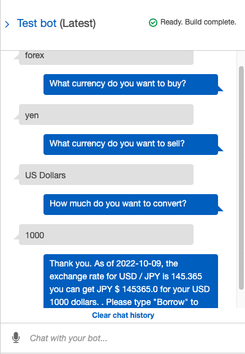
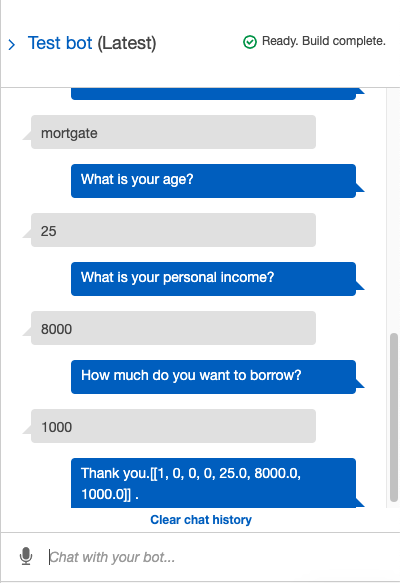

# AWS Lex Data Source - [Currency Rate Rate API](https://github.com/fawazahmed0/currency-api#readme)

Get the currency value (for example AUD/USD):

(https://cdn.jsdelivr.net/gh/fawazahmed0/currency-api@1/latest/currencies/aud/usd.json)

Import **requests** and **json** libraries to extract latest `date` and `rate`  from currency rate API

---

# Lex-powered robo

### Create two intents

1. Currency Converter

Users initiate conversation, and answer bot's questions. The answers will be fed into corresponding slots that through API will retrieve the daily exchange rates based on currencies pairs defined by end users. 

2. Money Lending Service

Once currency enquiry is completed, users will be directed to Money Lending Service intent. Users will be asked four questions, which have the same 'features set' as `X_train` as what our preferred Machine Learning Models used. The saved model loaded by the 'pickle' library from the previous step will `predict` the new ***`X` array***. Our preferred ML model will determine `1` or `0` , representing "High" or "Low" risk. 

The users will be advised an outcome by automatic Machine Learning 'approved' or 'not approved' status.

***Future development*** : user's `X` array has been successfully processed in chat bot, our preferred machine learning is also stored in AWS S3 bucket. However further code engineering is required for **loading** our saved model into AWS Lambda (please note: the loading model and prediction steps have been tested successfully in either Colab and Jupyter Lab )
