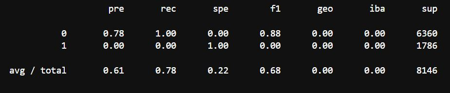
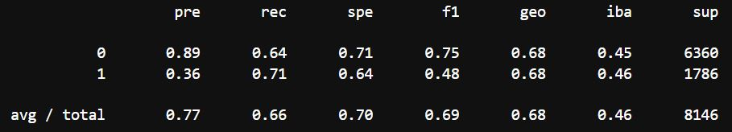
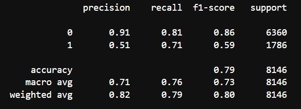
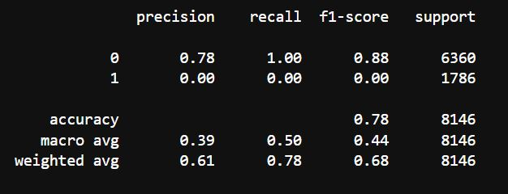
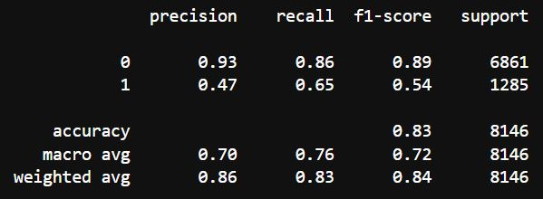
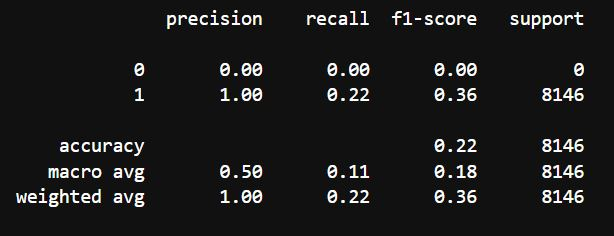
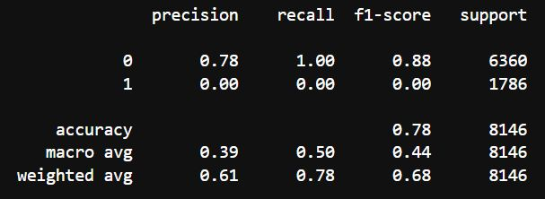
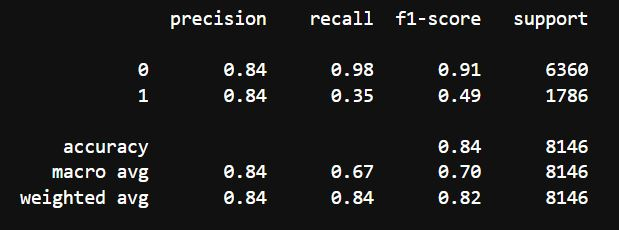
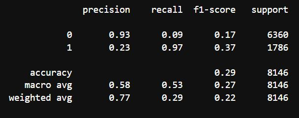

# Digital Lender

## Purpose

There are two complimentary goals in our project : first, to create a currency converter, and second, a money lending service. We utilize machine learning in order to determine the credit worthiness of the user. These services are delivered using Amazon Lex.

## The Data

The data used in our machine learning model comes from https://www.kaggle.com/datasets/laotse/credit-risk-dataset?resource=download . It essentially simulates credit risk data, such as a bank might collect.

### Manipulating The Data

For the purposes of this project we wanted to keep the data features to a minimum. Given the user will be asked to provide information that will then fill in each column, we did not want this question and answer process to be too long or invasive as the service would then be less attractive.

As such, the dataset was reduced from 12 columns to just 8. Given one column - "person_home_ownership" - was a categorical variable, this was expanded to 4 columns using OneHotEncoder().

The dataset also proved to contain a sampling bias, as is to be expected from a realistic credit risk dataset. Safe loans (25473) far outweighed risky loans (7108). This was corrected using RandomOversampler() resulting in equal 0 and 1 values in the target column.

The dataset values were also scaled using StandardScaler().

## Data Considerations

It becomes clear that when trying to produce a model that will be used in a real world situation, the dataset needs to be reliable, consistent, and real. This is difficult when dealing with a financial use case as acquiring such sensitive data is quite difficult.

Initially there was a desire to take feature columns from various dataframes and concatenate them into one datatframe that we would then use. This raises the issue of inconsistencies between dataframe features resulting in a final dataframe that has feature values that do not align. In other words, a row that has features that did not actually exist in the real world (no user presented with those particular combination of feature values) and therefore skewed and unrealistic data.

To then run a machine learning model on this dataframe and expect this model to predict a real world case is naive.

Ultimately, as has become clear through this course, quality of data is paramount.

## Applicability Considerations

For many reasons this project, at least the money lending aspect, is unlikely to be used in a real world situation. For one, a user can simply lie when answering the questions and thereby get a better interest rate. The project was intended as more of a "proof of concept". It allowed us to explore the combination of a machine learning backend with an Amazon Lex frontend. The concept of lending money was a convenient way to incorporate supervised machine learning with a clearly defined target - low risk or high risk.

While we do not see this service being useful as a money lender as it stands, we do see possibilities for something similar with the rise of online banking as well as decentralised loan services. The main weakness of our product is the unreliability of the data provided by the user. Solving this could be as simple as drawing from centralised services to provide rigorous credentials coupled with KYC (Know Your Customer). Allowing for collateralization would also make this service more realistic, however with modifications. There is also the medium to long term potential for digital identities that are tied to a user that could create a scenario where a user could verify themselves and provide credentials in a way that could be trusted https://vitalik.eth.limo/general/2022/01/26/soulbound.html.

## Finding The Best Model

### First Model: Linear Regression

Running the logistic regression model on the imbalanced data produced average results

The balanced accuracy score was 0.5.

Precision and recall for target value '1' produce 0 scores.

When the logistic regression model was run on the resampled data the results were much improved, however still unsatisfactory.

The balanced accuracy score was 0.6767254220456802.

The classification report also showed some disappointing numbers. Presicion for predicting quality loans was 36%, which is much too low to be of any use.

### Second Model: Balanced Random Forest

The second model ran produced better results than the first when run on the data without oversampling.

The balanced accuracy score was 0.7595678653679563. This is still not great, but is an improvement.

The classification report showed an imporvement in precision for both 0 and 1 targets. Recall was also improved.

When this model was reran using the oversampled data, the accuracy score, precision and recall all degraded.

### Third Model: K-Nearest Neighbors (KNN)

The third model, although better than the first, showed a slight loss of precision from the second model when run on the data without resampling.

The third model resulted in an accuracy report similar to the second model at 0.7560599383987882.

The classification report showed a slight reduction in precision and recall scores from the second model.

When the resampled data was applied to the model the balanced accuracy score was very poor at 0.21924871102381538. Precision and recall returned 0 scores for the '0' target value.

### Fourth Model: Support Vector Machines (SVM)

The fourth model outperformed previous models in terms of precision when run on the data without resampling.

The fourth model resulted in an accuracy report of 0.7807512889761846.

However, the classification report showed 0.0 precision and 0.0 recall for value '1'.

When the resampled data was applied to the SVM model, it caused the '.fit()' function to hang and ultimately crash the notebook. No results were produced for the resampled data.

### Fifth Model: Adaboost Model (Base Estimator = DecisionTreeClassifier)

The fifth model was the best performing model when run on the data without resampling.

This model resulted in an accuracy report of 0.8397170494891675.

The classification report shows 84% precision for both 0 and 1 values. Recall for 0 values was high at 98%, but quite low at 35% for 1.

When the resampled data was applied to this model the results were very poor, with an accuracy score of 0.2871347900810214. Recall and precision were also degraded.

### Results

We found it unusual that the resampled data performed poorly relatived to the original skewed data. Ultimately we decided to use the Adaboost model with the original data, simply split into training and testing sets and scaled, without resampling.

## Saving the Machine Learning Model

After running tests on multiple machine learning models it was clear that Adaboost had the best results.

In order to make this model available to new data we needed to save the model for later loading. We achieved this using the 'pickle' library. We used pickle to serialize our model and then later to deserialize the model to make new predictions on user generated data. 

---

# AWS Lex Data Source - [Currency Rate Rate API](https://github.com/fawazahmed0/currency-api#readme)

Get the currency value (for example AUD/USD):

(https://cdn.jsdelivr.net/gh/fawazahmed0/currency-api@1/latest/currencies/aud/usd.json)

Import **requests** and **json** libraries to extract latest `date` and `rate`  from currency rate API

---

# Lex-powered robo

### Create two intents

1. Currency Converter

Users initiate conversation, and answer bot's questions. The answers will be fed into corresponding slots that through API will retrieve the daily exchange rates based on currencies pairs defined by end users. 

2. Money Lending Service

Once currency enquiry is completed, users will be directed to Money Lending Service intent. Users will be asked four questions, which have the same 'features set' as `X_train` as what our preferred Machine Learning Models used. The saved model loaded by the 'pickle' library from the previous step will `predict` the new ***`X` array***. Our preferred ML model will determine `1` or `0` , representing "High" or "Low" risk. 

The users will be advised an outcome by automatic Machine Learning 'approved' or 'not approved' status.

***Future development*** : user's `X` array has been successfully processed in chat bot, our preferred machine learning is also stored in AWS S3 bucket. However further code engineering is required for **loading** our saved model into AWS Lambda (please note: the loading model and prediction steps have been tested successfully in either Colab and Jupyter Lab )
