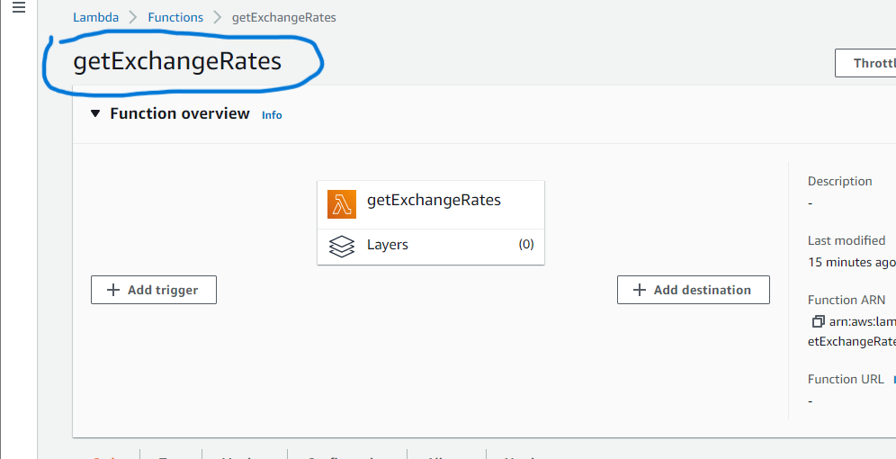

## Feel free to edit this part for final content.

## Might have to create a new function (same name) in Lambda before importing bot model, because the chat_bot jason file contains the 'getExchangeRates' which may cause error.
