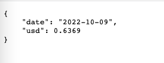

# Digital Lender

## Purpose

Our project has two complementary goals: first, to create a currency converter, and second, to create a money lending service. 

Many travellers may need a small loan, and we offer them the ability to convert top currencies.

We utilise machine learning to determine the user's creditworthiness and offer different rates and collateral requirements depending on the risk perception.

These services are delivered using a simple User Interface hosted online [here](https://moneygram-lend.anvil.app) .

# The Data

The data used in our machine learning model comes from [Kaggle](https://www.kaggle.com/datasets/laotse/credit-risk-dataset?resource=download). It essentially simulates credit risk data, such as a bank might collect. The target field is the "loan_status", which indicates if the loan has defaulted.

## Manipulating The Data

For this project, we wanted to keep the data features to a minimum. Given that the user will provide information that will fill in each column, making the service more attractive.

As such, the dataset was reduced from 12 columns to just 8. Given one column - "person_home_ownership" - was a categorical variable, this was expanded to 4 columns using OneHotEncoder().

The dataset also proved to contain a sampling bias, as is to be expected from a realistic credit risk dataset. Safe loans (25473) far outweighed risky loans (7108). This was corrected using RandomOversampler(), resulting in equal 0 and 1 values in the target column.

The dataset values were also scaled using StandardScaler() as the loan amounts vary.

## Data Considerations

It becomes clear that the dataset needs to be reliable, consistent, and accurate when trying to produce a real-world model. The difficulty arises when dealing with a financial use case, as acquiring such sensitive data is tricky.

Initially, there was a desire to take feature columns from various data frames and concatenate them into one data frame. However, this raises the issue of inconsistencies between data frame features resulting in a final data frame with feature values that do not align. In other words, a row with features that did not exist in the real world (no user presented with that particular combination of feature values) is skewed and unrealistic data.

To run a machine learning model on this data frame and expect this model to predict a real-world case is naive.

Ultimately, as has become clear through this course, the quality of data and preparation is paramount.

# Applicability Considerations

For many reasons, this project, at least the money lending aspect, is unlikely to be used in an actual situation. For one, a user can lie when answering the questions and thereby get a better interest rate. The project is intended as a "proof of concept". It allowed us to explore the combination of a machine learning backend with an Amazon Lex frontend. The concept of lending money was a convenient way to incorporate supervised machine learning with a clearly defined target - a low-risk or high-risk.

While we do not see this service as valuable as a money lender as it stands, we do see possibilities for something similar with the rise of online banking and decentralised loan services. The main weakness of our product is the unreliability of the data provided by the user. Solving this could be as simple as drawing from centralised services to provide rigorous credentials coupled with KYC (Know Your Customer). 

Allowing for additional collateralisation would also make this service more realistic, however, with modifications. There is also the medium to long-term potential for digital identities tied to a user that could create a scenario where a user could verify themselves and provide credentials in a way that could be trusted, such as the conceptual [soulbound token](https://vitalik.eth.limo/general/2022/01/26/soulbound.html).

# Dependencies 

Please see the following dependencies below for the build using Python version 3.7

# Finding The Best Machine Learning Model

## First Model: Linear Regression

The logistic regression model on the imbalanced data produced average results.

The balanced accuracy score was 0.5.

Precision and recall for target value '1' produce 0 scores.

When the logistic regression model was run on the resampled data, the results were much improved, however still unsatisfactory.

The balanced accuracy score was 0.6767254220456802.

The classification report also showed some disappointing numbers. The precision for predicting quality loans was 36%, which is much too low to be of any use.

## Second Model: Balanced Random Forest

The second model produced better results than the first when run on the data without oversampling.

The balanced accuracy score was 0.7595678653679563. This is still not great, but it is an improvement.

The classification report showed an improvement in precision for both 0 and 1 targets. The recall was also improved.

When this model was rerun using the oversampled data, the accuracy score, precision and recall all degraded.

## Third Model: K-Nearest Neighbors (KNN)

Although better than the first, the third model showed a slight loss of precision from the second model when run on the data without resampling.

The third model resulted in an accuracy report similar to the second model at 0.7560599383987882.

The classification report showed a slight reduction in precision and recall scores.

When the resampled data was applied to the model, the balanced accuracy score was inferior at 0.21924871102381538. Precision and recall returned 0 scores for the '0' target value.

## Fourth Model: Support Vector Machines (SVM)

The fourth model outperformed previous models in terms of precision when run on the data without resampling.

The fourth model resulted in an accuracy report of 0.7807512889761846.

However, the classification report showed 0.0 precision and 0.0 recall for value '1'.

When the resampled data was applied to the SVM model, it caused the '.fit()' function to hang and ultimately crash the notebook. No results were produced for the resampled data.

## Fifth Model: Adaboost Model (Base Estimator = DecisionTreeClassifier)

The fifth model was the best-performing model when run on the data without resampling. This is a model we did not use in class.

This model resulted in an accuracy report of 0.8397170494891675.

The classification report shows 84% precision for both 0 and 1 values. Recall for 0 values was high at 98% but relatively low at 35% for 1.

When the resampled data was applied to this model, the results were abysmal, with an accuracy score of 0.2871347900810214. In addition, recall and precision were also degraded.

# ML Results

We found it unusual that the resampled data performed poorly relative to the original skewed data. So ultimately, we decided to use the Adaboost model with the original data, split it into training and testing sets and scaled without resampling.

## Saving the Machine Learning Model

After running tests on multiple machine-learning models, it was clear that Adaboost had the best results.

To make this model available to new data, we needed to save the model for later loading. We achieved this using the 'pickle' library. First, we used pickle to serialise our model and then later to deserialise the model to make new predictions on user-generated data. 

---

# AWS Bot

## Lex Currency - Intent 1

1. Currency Converter

Users initiate conversation and answer the bot's questions. The answers will be fed into corresponding slots that, through API, will retrieve the daily exchange rates based on currency pairs defined by end users. 

### Data Source - [Currency Rate Rate API](https://github.com/fawazahmed0/currency-api#readme)

Get the currency value (for example, AUD/USD):

(https://cdn.jsdelivr.net/gh/fawazahmed0/currency-api@1/latest/currencies/aud/usd.json)

Import **requests** and **json** libraries to extract latest `date` and `rate`  from currency rate API

---

## Lex Loan - Intent 2

2. Money Lending Service

Once currency enquiry is completed, users will be directed to the Money Lending Service intent. 

Users will be asked four questions with the same 'features set' as `X_train` as our preferred Machine Learning Models used. The saved model loaded by the 'pickle' library from the previous step will `predict` the new ***`X` array***. Our preferred ML model will determine `1` or `0`, representing "High" or "Low" risk. 

Significant testing and troubleshooting was unsuccesful when integrating the Loan feature. A lack of time resulted in delgating the AWS Loan feature of the bot to future development.

***Future development*** : user's `X` array has been successfully processed in the chatbot. Our preferred machine learning is also stored in the AWS S3 bucket. However, further code engineering is required for **loading** our saved model into AWS Lambda (please note: the loading model and prediction steps have been tested successfully in either Colab or Jupyter Lab)

## Conceptual Bot

# User Interface (UX)

Anvil was our second choice after encountering significant drawbacks with Lambda, Lex and S3.

Anvil provides an easy-to-use drag-and-drop interface to design and deploy simle UX on the web.

Anvil has a buil in IDE and also has features that allow it to sync with Google Colab.

Google Colab is used as the backend server to do the heavy lifting while anvil allows hosting and publishing to the web.

The only drawback is that after 90 minutes of closing the Google Colab file, the Anvil app seems to lose connection. This is a know issue that we are working through.

More information on Colab integration with Anvil can be found [here](https://anvil.works/learn/tutorials/google-colab-to-web-app)

# Final Product

