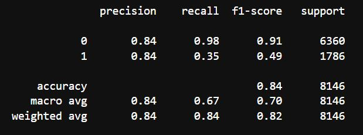

# Draft

It becomes clear that when trying to produce a model that will be used in a real world situation, the dataset needs to be reliable, consistent, and real. This is difficult when dealing with a financial use case as acquiring such sensitive data is quite difficult.

Initially there was a desire to take feature columns from various dataframes and concat them into one datatframe that we would then use. This raises the issue of inconsistencies between dataframe features and resulting in a final dataframe that has feature values that do not align. In other words, a row that has features that did not actually exist in the real world (no user presented with those particular combination of feature values) and therefore skewed and unrealistic data.

To then run a machine learning model on this dataframe and expect this model to predict a real world case is naive.

Ultimately, as has become clear through this course, quality of data is paramount.

### First Model: Linear Regression

The first model run ont he dataset did not produce outstanding results.

The balanced accuracy score was 0.6767254220456802 , which is very low.

The classification report also showed some disappointing numbers. Presicion for predicting quality loans was 36%, which is much too low to be of any use.

### Second Model: Balanced Random Forest

The second model ran prduced better results than the first.

The balanced accuracy score was 0.7595678653679563. This is still not great, but is an improvement.

The classification report showed an imporvement in precision for both 0 and 1 targets. Recall was also improved.

### Third Model: K-Nearest Neighbors (KNN)

The third model, although better than the first, showed a slight loss of precision from the second model.

The third model resulted in an accuracy report similar to the second model at 0.7560599383987882.

The classification report showed a slight reduction in precision and recall scores from the second model.

### Fourth Model: Support Vector Machines (SVM)

The fourth model outperformed all previous models in terms of precision.

The fourth model resulted in an accuracy report of 0.7807512889761846.

However, the classification report showed 0.0 precision and 0.0 recall for value '1'.

### Fifth Model: Adaboost Model (Base Estimator = DecisionTreeClassifier)

The fifth model was the best performing model.

This model resulted in an accuracy report of 0.8397170494891675.

The classification report shows 84% precision for both 0 and 1 values. Recall for 0 values was high at 98%, but quite low at 35% for 1.

